# itmo_python_practice_4

## Создание контейнеров
### Запуск контейнера с nginx
```bash
docker run -d --name my-nginx -p 8081:80 nginx
```
### Запуск контейнера с WSGI-сервером на Python
### Создадим файл app.py с простым Flask-приложением:
```python
from flask import Flask

app = Flask(__name__)

@app.route("/")
def hello():
    return "Hello from WSGI server!"

if __name__ == "__main__":
    app.run(host="0.0.0.0", port=8082)
```
### Запускаем контейнер
```bash
docker run -d --name my-wsgi -p 8082:8082 -v $(pwd):/app -w /app python:3.9-slim python app.py
```
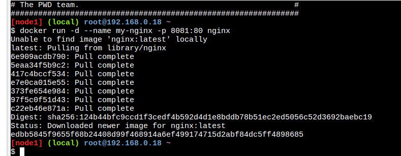
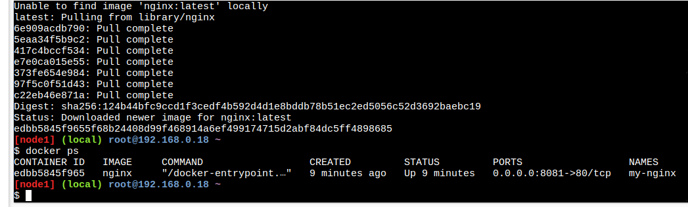
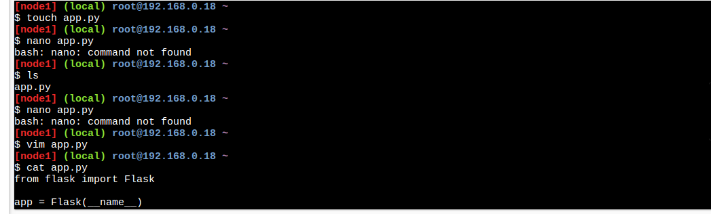
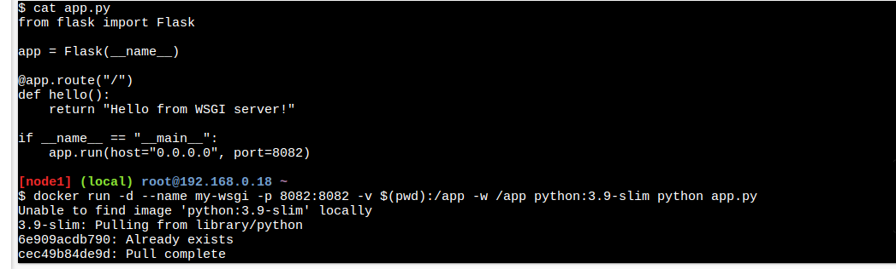
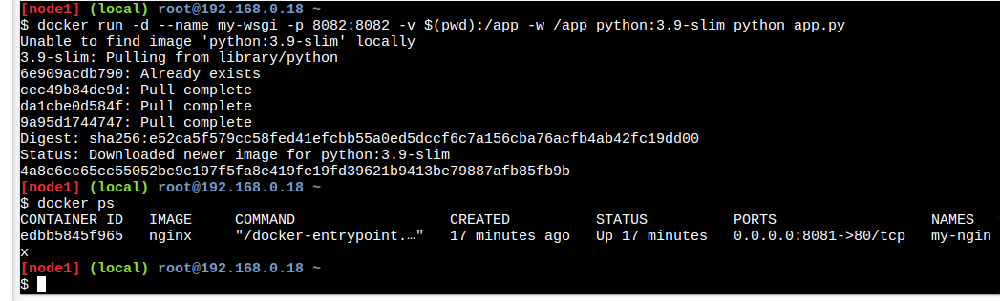

## Создание образов
### Создание Dockerfile для nginx
```Dockerfile
FROM nginx:latest
COPY index.html /usr/share/nginx/html/index.html
```
```bash
docker build -t my-nginx .
```
### Создание Dockerfile для WSGI-сервера
```Dockerfile
FROM python:3.9-slim
WORKDIR /app
COPY requirements.txt .
RUN pip install -r requirements.txt
COPY . .
CMD ["python", "app.py"]
```
```bash
docker build -t my-wsgi .
```
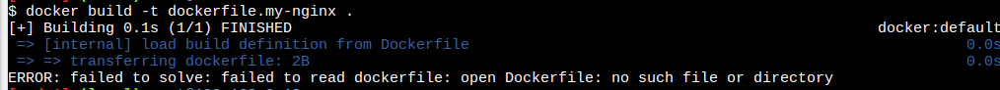
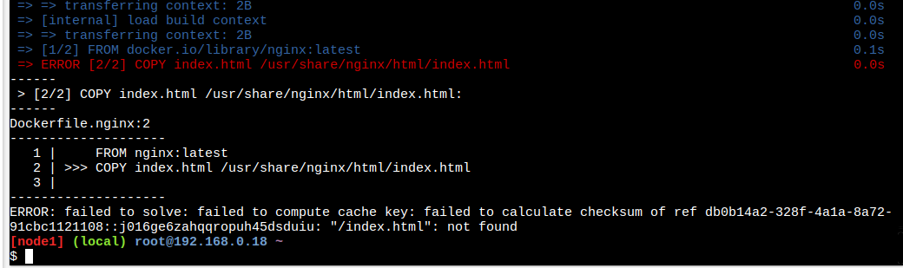
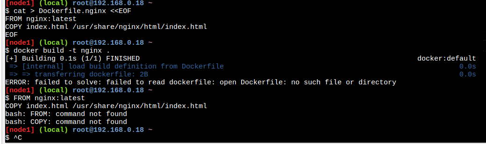
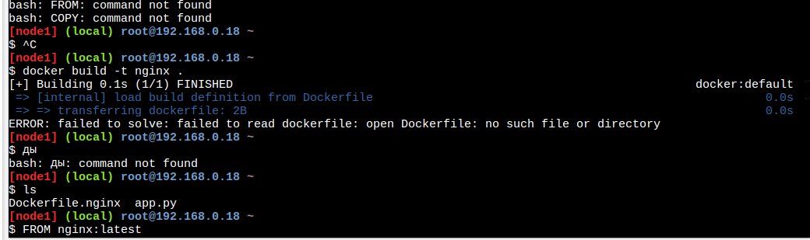
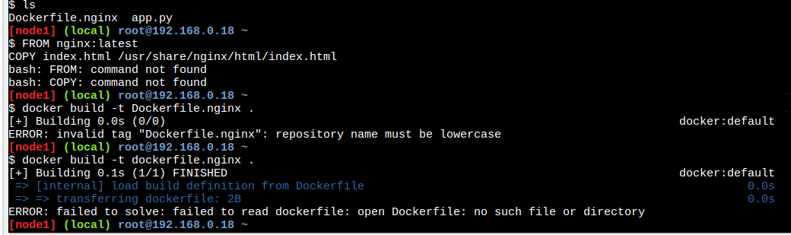
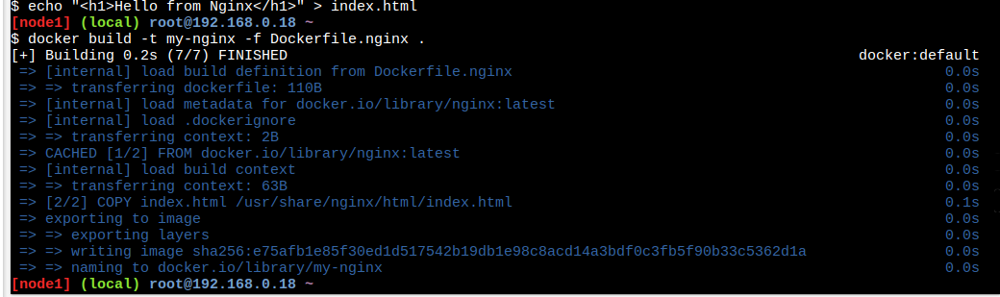
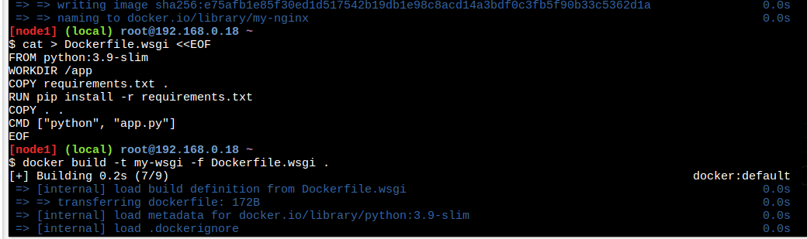

## Загрузка образов в Docker Hub
```bash
docker login -u <username>
docker tag my-nginx <your_dockerhub>/my-nginx
docker tag my-wsgi <your_dockerhub>/my-wsgi
docker push <your_dockerhub>/my-nginx
docker push <your_dockerhub>/my-wsgi
```
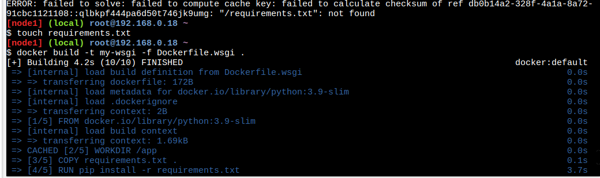
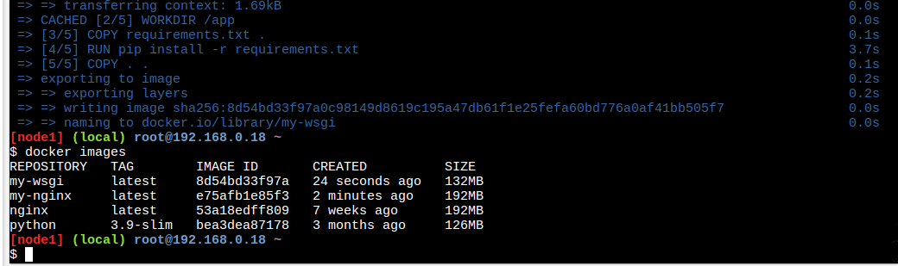
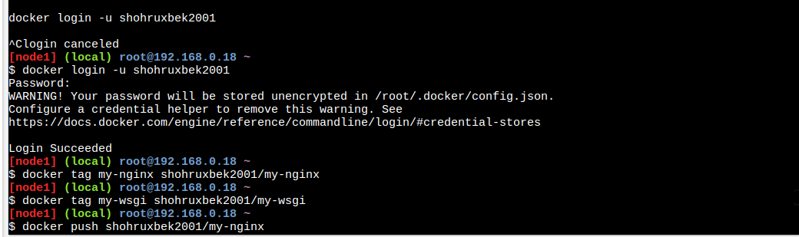
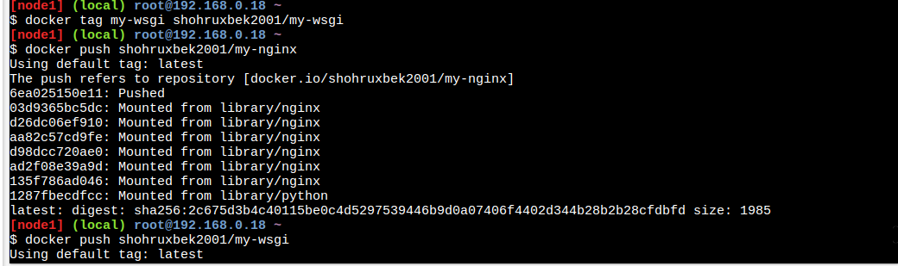

## Использование docker-compose
### Создадим docker-compose.yaml:
```yaml
version: "3"

services:
  nginx:
    image: my-nginx
    ports:
      - "8083:80"
    depends_on:
      - wsgi

  wsgi:
    image: my-wsgi
    ports:
      - "8082:8082"
    volumes:
      - ./app:/app
```
### Запускаем:
```bash
docker-compose up -d
```
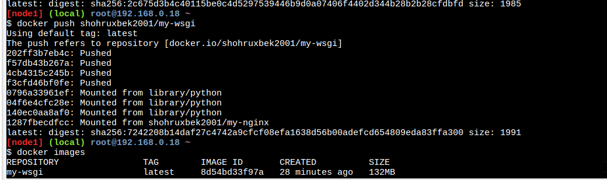
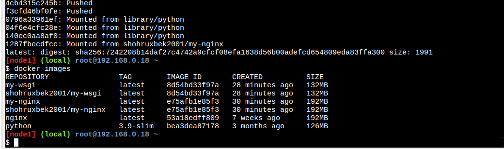
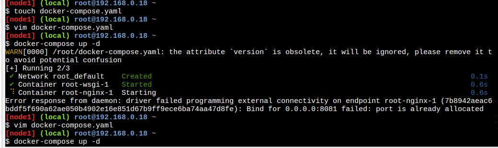
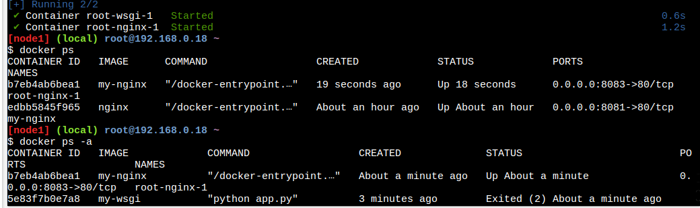
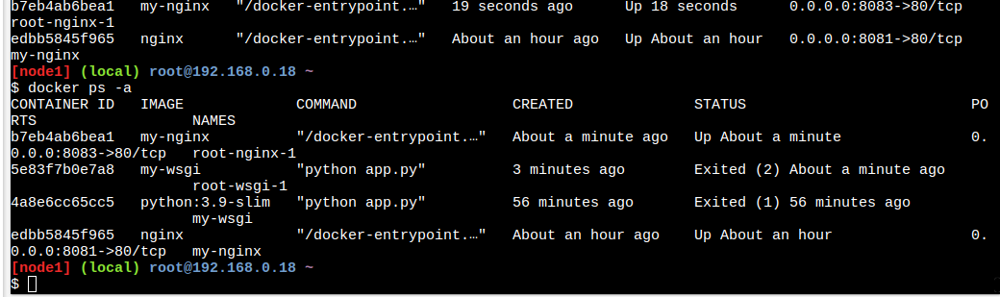